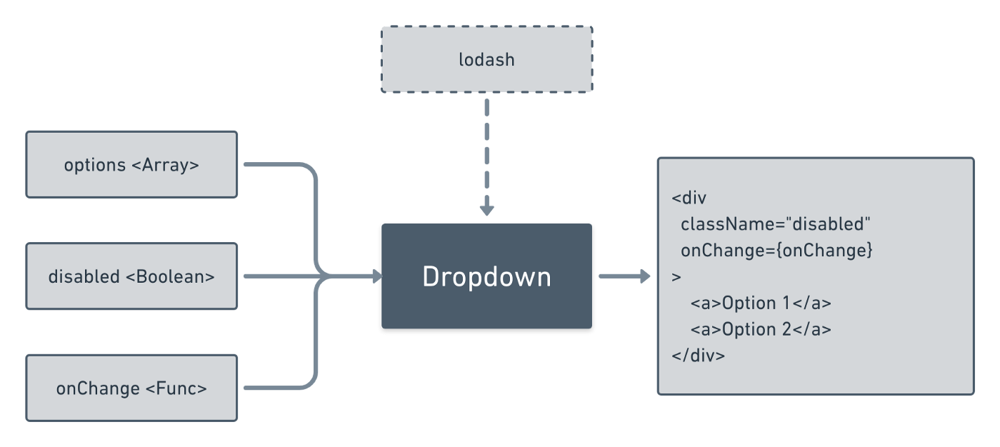

Building a React web application, for the most part, is writing [components](https://reactjs.org/docs/glossary.html#components) which combine to form your user interface. But there are certain components which are reused across your entire application — Button, Link, Dropdown, Tooltip, etc.

For larger projects, all these components reside in a common style guide. You pick up components from the style guide and use it wherever you want. These are just like any other React components, but they need to have one special feature — **customizability**.

No matter how strict the design guidelines are, you cannot expect the same type of button to be used everywhere. There will be some changes required based on the context. The problem becomes even more pronounced, if you are building a separate module for a component ([react-16-dropdown](https://github.com/ankit-m/react-16-dropdown)).

Customizability allows them to be modified, both visually and functionally, to fit in various use cases. This article outlines certain ways to make your React component highly customizable. Throughout this guide, I will use a Dropdown component to illustrate examples.

> **Note:** You do not need to build all your components to be so customizable. For components which you know will not be used anywhere else, can be simple.

## 1. Define boundaries

First of all, you should to determine the **expectation** from your component. Try to answer questions like:

- What is the use of your component?
- What is the input?
- What is the output?
- Does the component have any side effects?
- What are the dependencies?
- What is the component _NOT_ supposed to do?

At the end of this exercise, you should have a black box representation of your component.

<figure>
  
  <figcaption>Simplified black box representation for your component</figcaption>
</figure>

Having a well defined boundary allows you to make architectural decisions as well assumptions about the usage.

## 2. Simple use case first approach

Always try to make the component easy to start off with — minimum or no input from the consumer. It should solve the simplest use case as quickly as possible. In case of the dropdown, following is the simplest usage-

```js
const options = [{id: 1, label: ‘opt 1’}, {id:2, label:’opt 2’}];

<Dropdown options={options} onClick={e => console.log(e)} />
```

This makes it easy for consumers who are _prototyping_ or _evaluating_ your component for further use. It is also very helpful for beginners to start off.

Ensure that the installation process is _straightforward_ and _standard_. You should NOT expect the consumer to make exceptions or add _polyfills_ to use your component.

## 3. Basic customization

Consumers will expect you to support simple changes to your component out of the box. For example, it is common for any interactive element to support a `disabled` prop.

To find out these basic customization options, I find it easy to think of changes in two broad categories -

### 3.1 Functionality changes

These affect the way your component behaves. Think carefully about what changes you want the consumer to make. You may not need to support functionality changes for simple components, but it might make sense for complex components — `Select` dropdown component can support a `multiselect` prop which allows for multiple choices.

- Use your black box representation to identify the functionality changes needed.
- For each functionality change identify if it is the responsibility of the component to implement or that of the consumer.

### 3.2 Style changes

These affect the way your component looks. You cannot make any assumptions about the styles and give the consumer maximum freedom to change it.

Following are a few strategies to make your component easy to style-

- Simple props: Support optional props like size, align, disabled which will allow consumers to make quick adjustments.
- CSS classes: If your code is styled purely using classes, consumers can simply override the class rules. Ensure that your class names are intuitive and easy to understand.
- Avoid `!important` and multiple [combinators](https://developer.mozilla.org/en-US/docs/Web/CSS/CSS_Selectors#Combinators) in your CSS. It is very difficult to override something like `.dropdown > .option > button > span`.

## 4. Renderers and Components

The goal is to make it very easy for consumers to adapt the component for their use case. In most cases, these changes are UI changes — changing the appearance, adding different styles, etc. In order to achieve this, I split the building blocks into components and renderers.

For dropdown, following are the building blocks:

- `Option`: `OptionComponent` and `OptionRenderer`
- `Trigger`: `TriggerComponent` and `TriggerRenderer`
- `Menu`: `MenuComponent` and `MenuRenderer`

### 4.1 Renderer

The renderer only cares about how the component looks and other items which need to be displayed. This has all the CSS classes attached and accepts the bare minimum props required for display. If a user wants to use their custom component, they can simply pass the custom renderer as a prop.

### 4.2 Component

These handle the business logic for the particular block — event handlers, refs, roles, etc. These are just containers and do not have any styles. This abstracts away the working logic from rendering and consumers can simply swap out renderers without affecting the functionality. Advanced consumers, who want complete control, can replace this component and handle everything themselves.

This splitting allows for quicker changes and promotes modular code, improving the testability of your code.

```js
/**
 * Default trigger renderer - Displays a plain button
 * with label
 */
function TriggerRenderer(props) {
  return (
    <button className="trigger-renderer" disabled={props.disabled}>
      {props.label}
    </button>
  )
}

/**
 * Default trigger component - Renders a div with
 * all the handlers
 */
function Trigger(props) {
  const Renderer = props.renderer || TriggerRenderer

  return (
    <div ref={props.triggerRef} role="button" onClick={props.onClick}>
      <Renderer disabled={props.disabled} label={props.label} />
    </div>
  )
}

/**
 * Consumer of the component can swap out either the renderer or
 * the complete component
 */
function Parent(props) {
  const TriggerElement = props.triggerComponent || Trigger

  return <TriggerElement {...props} renderer={props.triggerRenderer} />
}
```

Changing the renderer is simply passing a presentational component

> Some might not prefer this splitting as it might create extra HTML tags. If that worries you so much, then you can simply allow to replace the entire component.

## 5. Custom props

Your component will render certain HTML elements. These elements will have attributes which you programmed for.

You should also allow the consumer to pass in custom props for these HTML elements. This can be useful for someone who wants to add additional event handlers or tags like aria which you might not have included out of the box.

```js
function Trigger(props) {
  return (
    <div
      onClick={props.onClick}
      {…props.customTriggerProps}
    >
      Text
    </div>
  );
}
```

## 6. Lightweight

One of the biggest hurdle for adopting a third party React component is its bundle size. If your component adds 40kB as compared a few kBs if custom built, then there is a high chance that your component might lose out — even if it provides better functionality.

A few strategies to keep your output bundle size low:

- Minify and/or uglify the production output file.
- Make sure that all parent requirements like React and ReactDOM are listed in `peerDependencies` in your `package.json` file.
- If your component has a lot of variants/sub-components, allow for partial imports — `import subComp from package/subComp`
- Keep the number of third-party libraries you depend on to a minimum.

## 7. Accessibility

In modern web applications, just achieving functionality isn’t enough. You also need to take special care for accessibility.

### 7.1 Keyboard

Your component should be usable by keyboard. This means using the correct type of HTML tags (i.e. button and a for interactive elements) and handling focus in case of custom widgets.

You can also decide to handle keyboard events yourself within JavaScript. You might miss out on default browser behaviour and other benefits which come along with keyboard focus.

### 7.2 Screen reader

For people who use screen readers, it is crucial that your component add additional information for them to use. This includes using alt, role, aria and other attributes. Refer the [accessibility guide](https://reactjs.org/docs/accessibility.html) in the React documentation for further information.

## 8. Resist non-standard syntax

It is very tempting to use modern JavaScript syntax and make your code look pretty and concise. This might not be a good a idea for various reasons —

- Browser support & transpiling: Older browsers do not support the latest syntax and you would need to transpile your code for compatibility.
- Bundle size: Transpiling will increase your bundle size and may have a detrimental effect of on the performance.
- Consumer limitation: Assuming support for modern syntax/features may prevent certain developers from using your component who do not have the same luxury and need to be compatible with older browsers.

## 9. Enforcing certain usage

It is easy for usage anti-patterns to creep in when a library is consumed by people who do not know how and why it was built. As a developer, your job is to convey this information and enforce proper usage —

- Component design: Let’s take the dropdown example. You can choose to pass options as an array of objects or as children

```js
// Method 1
const options = [{id: 1, label: ‘opt 1’}, {id:2, label:’opt 2’}];

<Dropdown options={options} onClick={e => console.log(e)} />


// Method 2
<Dropdown>
  <Option id=‘1’>opt 1</Option>
  <Option id=‘2’>opt 2</Option>
</Dropdown>
```

Your code might only expect `Option` to be passed as children but, _Method 2_ might create a false expectation for the consumer that they can pass anything and the component might break. An anti-pattern usage could be -

```js
// Anti-pattern usage which might break your component
<Dropdown>
  <div class=‘section-1’>
    <Option id=‘1’>opt 1</Option>
    <Option id=‘2’>opt 2</Option>
  </div>
  <div class=‘section 2’>
    <Option id=‘1’>opt 1</Option>
    <Option id=‘2’>opt 2</Option>
  </div>
</Dropdown>
```

You should be able to determine the best way to use your component and enforce that by the way you design your component.

- Proptypes: [React proptypes](https://reactjs.org/docs/typechecking-with-proptypes.html#proptypes) are a great way to typecheck the props your component accepts and prevent basic mistakes made by consumers.
- Documentation: This is one the easiest way to convey information to consumers. It is crucial to highlight **what** is the purpose component along with usage examples.
- Test cases provide a good reference point to consumers for what and what not to do.

## Conclusion

Overall, I have tried to highlight a few ways to build customizable components in React. However, how much customization to offer depends on the use case and problem you are trying to solve. You should evaluate and pick what makes sense for you.
