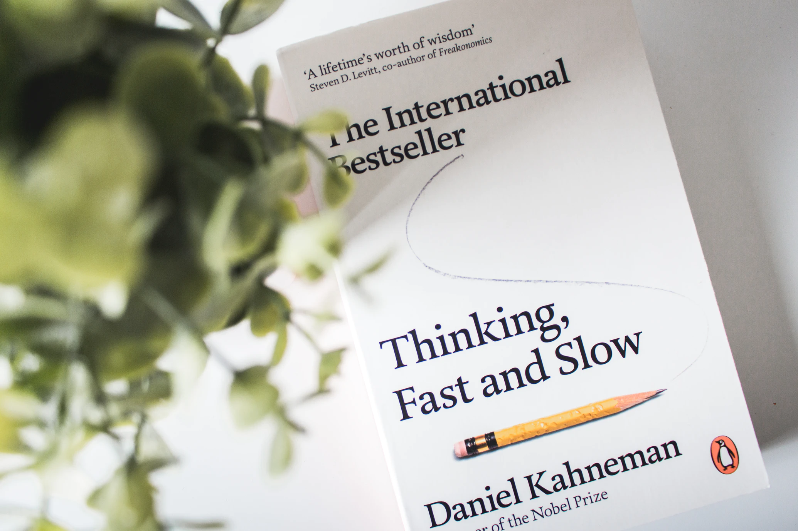

Daniel Kahneman writes the book with a simple goal - _Enable the reader to have smarter water cooler conversations_. Drawing on his research, spanning decades, he presents an introduction to cognitive psychology and how it applies to a variety of scenarios - from day-to-day life to economic theory.

The book uses two **imaginary** systems in our mind, System 1 (causal) and System 2 (analytical), to explain how humans behave and make decisions in different circumstances. There are a dizzying number of experiments which make you question whether your brain is nothing but a lump of squishy mass. The purpose of these behavioural experiments is to highlight “how” and “why” you make certain decisions in different scenarios.

For example, Max is a soft spoken man in his 40s who wears glasses and likes meditation. Is Max likely to be a librarian or a farmer? I bet you thought librarian, just like I did. But purely from a statistical perspective, there are a lot more farmers than there are librarians. So our rational guess should be a farmer. System 1 forces us to think causally - a soft spoken man, spectacled man who likes meditation has to be a librarian. But alas, we don’t have enough evidence to refute statistics. 

> What you see is all there is.  

One of the biggest application of understanding human decision making is in economic theory. How we make decisions when there are monetary gains and losses involved. This part of the book primarily focuses on _expected utility theory._In a nutshell, if I give you a gamble where you have 20% chance of losing $10 and 80% of winning $90. Would you take it? Contrary to _utility theory_, it depends on the amount of money you have. If you have $50, you are less likely to take the gamble as compared to if you have $500.

While economic applications of decision making are logical, I did not expect it to be applied to how we reflect on our lives. The most striking of these is “peak-end and duration neglect” - we tend to evaluate our lives by recent memories and the peaks in the past, neglecting the things in between.

> Humans, unlike econs, need help in making decisions.  

The book provides the tools to do so.

## Learnings and Takeaways
* **Take a step back and think**: This is a gross generalization of the whole book. But through experiments and real-world examples, it proves that in many scenarios just taking a step back and thinking about the outcomes, with the right decision making tools, can help us achieve better outcomes. 

* **Respect Randomness**: There are lot of patterns in the world. While many of them have a cause, others  are just due to chance and randomness. Your favourite team might have won 3 straight championships, and is languishing somewhere in the middle this year. This could just be regression to mean.

* **Law of large numbers**: As the famous saying goes, 2 points don’t make a trend. It is fair to say that even 3 or 4 might not be enough to justify a trend. It is crucial to evaluate the sample set size before making any assertions.

* **Long trades**: Although I am not into stock trading, the book makes a very convincing statistical and psychological argument as to why an investor should look for long-term trades rather than short-term gains. One simple way to start doing this is by checking your investment app less often.

* **Hiring**: Making a conscious attempt to avoid Halo effect and decision bias.

