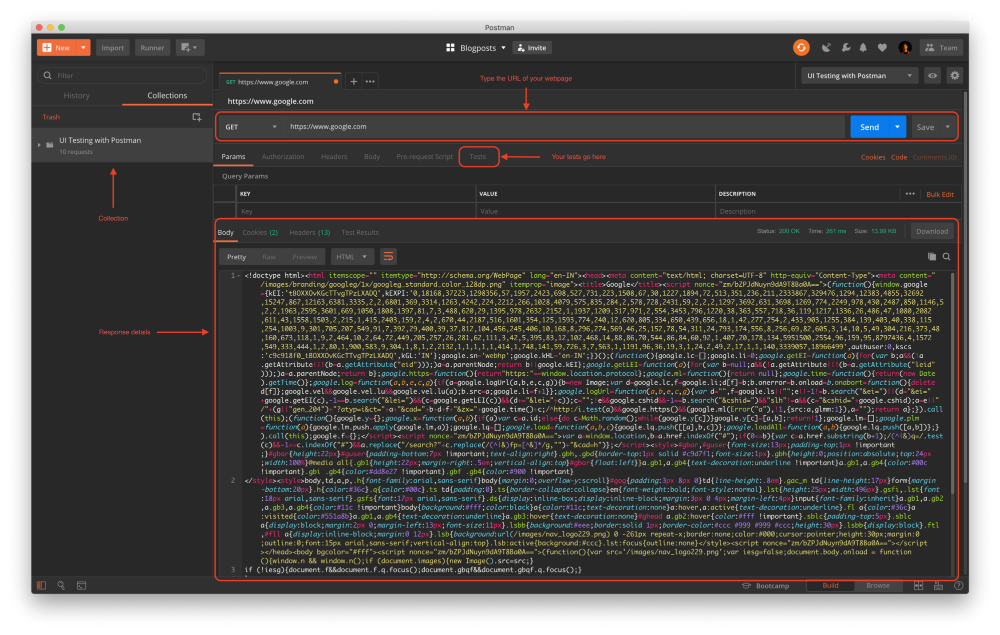
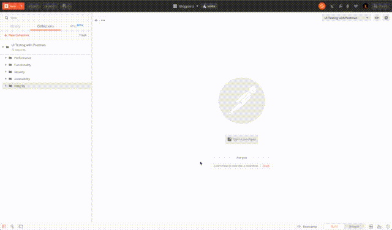
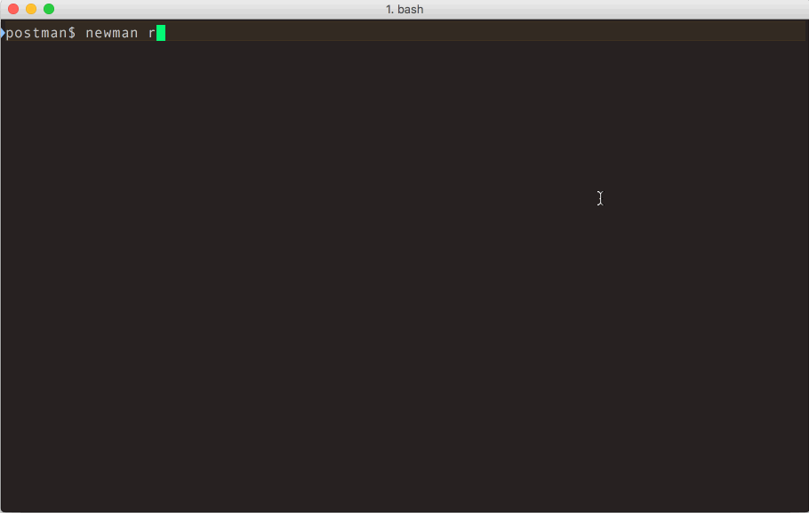

[Postman](https://www.getpostman.com/) is a tool commonly used to work with APIs. It provides an easy way to make HTTP calls and run scripts during various phases of the request. We can leverage these features for **continuous and automated** UI testing.

This article outlines a few ways of using Postman to test various aspects of a UI viz. performance, functionality, security, integrity and accessibility. We will also look at how to run these tests periodically and get notified about the results.

## 0. Setup and Postman Primer



Postman primarily provides you with an environment to create and interact with APIs. It can also be used to request web pages (just like a browser). Enter the URL in the address bar and hit send to see the HTML response. Postman can run scripts before sending the request (**Pre-request scripts**) and after obtaining the response (**Tests**). Each request is stored in a \_collection,\_which can be run to execute all requests in order.

If you have never used Postman, head over to the [Learning Center](https://learning.getpostman.com/) for more information.

> **Note**: Postman does not evaluate JS or external CSS on a webpage. A few techniques described here might not work for pages which are rendered client side or which rely heavily on JavaScript.

## 1. Performance

Various factors affect the performance of a webpage — time to receive data from the server, first meaningful render, etc.

/We will create a new request for each type of test and add the corresponding code snippets in the/_Tests_/tab. At any point, you can use the or directly import the in Postman./ [reference collection](https://documenter.getpostman.com/view/1411527/SW12zxWj) [template](https://explore.postman.com/templates/4238)

- **Response time**: This is the time it took for a client to receive the complete response (HTML in this case) after making the request. We can set maximum response time threshold.

```js
var ONE_SECOND = 1000;

pm.test(“Response time is less than 1 second”, function () {
  pm.expect(pm.response.responseTime).to.be.below(ONE_SECOND);
});
```

- **Headers**: Response headers can be used to check server configuration for caching and encoding of the data. These help you improve the page load time and reduce number of bytes transmitted over the network.

```js
pm.test(“Cache control header should be for 14 days”, function () {
  pm.response.to.be.header(“Cache-Control”, “max-age=1209600”);
});

pm.test(“Content encoding should be set to gzip”, function () {
  pm.response.to.be.header(“Content-Encoding”, “gzip”);
});
```

- **Response size**: The actual size of your first response (HTML page).

```js
pm.test(“Response size is less than 35KB”, function () {
  pm.expect(pm.response.responseSize).to.be.below(35000);
});
```

- **PageSpeed Insights API**: Google provides a feature rich [PageSpeed](https://developers.google.com/speed/docs/insights/v5/get-started) API to evaluate the performance of any webpage. You can call the API from Postman and assert on the results to set benchmarks for your UI.

```js
// GET https://www.googleapis.com/pagespeedonline/v5/runPagespeed?url={{url}}

pm.test(“PageSpeed score should be within 90 and 100”, function () {
  var res = pm.response.json();
  var score = res.lighthouseResult.categories.performance.score;

  pm.expect(score * 100).to.be.within(90, 100);
});
```

## 2. Functionality

- **Status code**: Response status is the most basic test for uptime. If the server returns an unexpected status code, your web page might not be working correctly.

```js
pm.test("Status code is 200", function () {
  pm.response.to.have.status(200)
})
```

- **Page structure**: You can evaluate the response markup for sanity checks using cheerio library. These can check for presence of necessary tags and critical elements.

```js
var cheerio = require("cheerio")
var $ = cheerio.load(pm.response.text())

pm.test("Page title should be set", function () {
  pm.expect($("title").text()).to.equal("Ankit Muchhala")
})

pm.test("Page should have header and footer tags", function () {
  pm.expect($("header")).to.exist
  pm.expect($("footer")).to.exist
})
```

- **Headers**: Basic tests can be written for response headers which determine the functionality of the webpage — `Content-Type`, `Set-Cookie`, etc.

- **Manifest**: If you are building a web app/PWA to be installed on mobile devices, your application should serve a manifest.json file and have a corresponding link in the head tag.

```js
pm.test("Manifest file should exist", function () {
  pm.response.to.have.header("Content-Type", "application/json")
})

// Add more tests to check manifest file
pm.test("Manifest should have valid fields", function () {
  var jsonData = pm.response.json()

  pm.expect(jsonData.name).to.equal("Ankit Muchhala")
})
```

- **Service worker**: If you have a service worker file, you can check for its existence and content.

```js
pm.test("Service worker file should exist", function () {
  pm.expect(pm.response.headers.get("Content-Type").split(";")).to.include(
    "application/javascript"
  )
})
```

## 3. Security

- **HTTPS and HSTS**: If you want the communication between client and server to be secure, your webpage must be served over HTTPS. You also need to ensure that all insecure calls (HTTP) are redirected to the secure protocol. You can also set the `Strict-Transport-Security` header to tell the browsers to connect to your servers **only** through a secure protocol.

```js
pm.test("Response should have status code is 301", function () {
  pm.response.to.have.status(301)
})

pm.test("Response should redirect to secure URL", function () {
  pm.response.to.have.header(
    "Location",
    "https://" + pm.environment.get("host") + "/"
  )
})

pm.test("Strict-Transport-Security header should be set", function () {
  pm.response.to.have.header(
    "Strict-Transport-Security",
    "max-age=300; includeSubDomains"
  )
})
```

- **Headers**: There are security headers which you can utilize to achieve certain security benefits. Ex. `X-XSS-Protection`, `X-Frame-Options`, etc. You can find a complete list here and add tests for the ones you are using.

- **No referrer**: You can also run some sanity tests on the HTML to check for common security issues — using `eval`, unnecessary `iframes` or inline JavaScript. One such test is to verify that all `a` tags with `target="_blank"` (i.e. links which open in a new tab/window) have `rel="noopener noreferrer"`. This means that the newly opened tab will not have access your webpage via `document.referrer`.

```js
var cheerio = require("cheerio")
var $ = cheerio.load(pm.response.text())

pm.test("All external ... valid attributed", function () {
  $("a").each(function (i, elem) {
    if ($(elem).attr("target") !== "_blank") {
      return
    }

    pm.expect($(elem).attr("rel")).to.equal(
      "noopener noreferrer",
      $(elem).attr("href")
    )
  })
})
```

- **Robots.txt**: This file resides at the root level `/robots.txt` and specifies how web crawlers (like Google’s bot) should interact with your webpages. Even though it does not **enforce** anything — evil bots might simply ignore — it is a good practice to have a `robots.txt` file which clearly denotes which routes are allowed to be crawled.

```js
pm.test("robots.txt file should exist", function () {
  pm.response.to.have.header("Content-Type", "text/plain")
})

// add specific tests for your robots.txt file
```

## 4. Integrity

These tests verify that your webpage is serving data from verified sources and links to pages which are valid.

- **Link validity**: Often you want to verify that all links in your page are valid and that they don’t lead the user to a webpage which is unavailable. The following script finds all the links in your webpage and checks if they exist (i.e. making a `GET` request returns a `200` status code). We make use of the **pm.sendRequest** method here.

```js
var cheerio = require("cheerio")
var $ = cheerio.load(pm.response.text())

pm.test("All links on the page should be valid", function () {
  $("a").each(function (i, elem) {
    var originalPath = $(elem).attr("href")
    var path = originalPath

    if (path && path[0] === "/") {
      path = pm.environment.get("url") + path
    }

    pm.sendRequest(path, function (err, res) {
      pm.test(
        'Link with href "' + originalPath + '" should be valid',
        function () {
          pm.expect(err).to.equal(null)
          pm.expect(res).to.have.property("code", 200)
          pm.expect(res).to.have.property("status", "OK")
        }
      )
    })
  })
})
```

- **CSP**: Content Security Policy headers specify a list of valid sources for different types of content which the browser can execute. For example, you can say — allow JavaScript to be loaded from the current domain (`self`) and `getpostman.com`. The browser will block other sources from executing content. This helps safeguard your application in case someone has injected malicious code into it. **Note: CSP checks are browser dependent and should not be used as a sole line of defence.**

## 5. Accessibility

All modern webpages are expected to be mobile friendly and accessible for users with disabilities. This means using semantically correct HTML tags, ARIA labels and relevant attributes like `alt` or `role`. As illustrated before, you can use cheerio to write tests for these.

<hr>

## Running your Tests

There are multiple ways to run your collection.

### In Postman

- Click on your collection in the sidebar
- Click on Run. This opens the Collection Runner
- Configure your options and Run!

<figure>
  
  <figcaption>Running tests via Collection Runner</figcaption>
</figure>

### In CLI

You can run the collection in CLI using newman using newman run command.

<figure>
  
  <figcaption>Taken from Postman Learning Center</figcaption>
</figure>

### In Postman Monitors

You can setup a monitor to run your tests periodically and also pipe those results to slack.

There are a lot of other tests which can be performed on web pages in Postman. If you have any in mind, please let me know in the comments.
